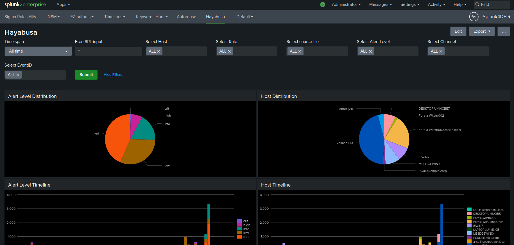

# Splunk4DFIR

## Description

Quickly spin up a splunk instance with Docker to browse through logs and tools output during your investigations. 



This is a simple quality of life improvement project built upon the amazing work below:

- https://github.com/omerbenamram/evtx
- https://github.com/whikernel/evtx2splunk
- https://github.com/splunk/docker-splunk
- https://github.com/SigmaHQ
- https://github.com/Yamato-Security/hayabusa
- https://github.com/mthcht/ThreatHunting-Keywords
- https://github.com/magicsword-io/LOLDrivers

Splunk4DFIR is made of 3 main components: 
  - some basic data ingestion configuration modules and scripts
  - a collection of ready to use dashboards to get started visualizing the data
  - savedsearches translated from [sigma rules](https://github.com/SigmaHQ/sigma) to be run against the data for triage

## Motivation

SOC to DFIR is getting a natural career path and considering the current market shares of Splunk and Crowdstrike, familiarity with SPL(-like) query languages is getting widespread within the DFIR community. This project enables you to quickly spin up in no time on whatever workstation you have in your hands a lightweight environment to demonstrate your SPL-fu and save the day.

In DFIR it is common to juggle between different VMs and operating systems to be able to use all your favourite tools. Using Docker is convenient for portability.

When it comes to evtx files specifically, key differenciator of this project is that it provides a light ananalysis environment that can run on a single linux host where most splunk lab environment typically requires a dedicated windows host because official Splunk evtx ingestors rely on underlying windows OS APIs.  


## HOW-TO

Drop your files under the appropriate folder in `artifacts/` then build and run the container.

```
sudo docker build -t splunk4dfir .
sudo docker run --name splunk4dfir -e SPLUNK_START_ARGS=--accept-license -e SPLUNK_PASSWORD=changeme -p 8000:8000 -p 8089:8089 -v ./artifacts:/mnt/artifacts splunk4dfir:latest start
```

goto: http://127.0.0.1:8000/en-US/app/Splunk4DFIR/search

Some errors during build may be due to an older version of docker that doesnt use BuildKit by default, you may try the following workaround in this case: `sudo DOCKER_BUILDKIT=1 docker build -t splunk4dfir .`

If you dont see data being ingested, check the permissions of your artifacts files.

## Supported inputs

- `artifacts/json/`: drop there arbitrary json files
- `artifacts/csv/`: drop there arbitrary csv files
- `artifacts/cloudtrail/`: drop there exported cloudtrail logs
- `artifacts/evtx/`: drop there windows logs evtx files
- `artifacts/zeek/`: drop there your json zeek files
- `artifacts/suricata/`: drop there your eve.json suricata file
- `artifacts/supertimelines/`: drop there your plaso l2tcsv outputs

additionnaly some macros are configurable to point to specific tools output sourcetypes:

- `autorunsc`: points to autorunsc csv output files
- `prefetch`: points to PECmd csv output files
- `amcache`: points to AmcacheParser csv output files
- `shimcache`: points to AppCompatCacheParser csv output files
- `timeline`: points to simple timeline files
- `winevtx`: points to EvtxECmd csv output files
- `hayabusa`: points to hayabusa csv output files


## Ingest evtx as json

Once splunk is up and running you can trigger the evtx logs ingestion with: 

```
sudo docker exec -it splunk4dfir sudo /opt/splunk/etc/apps/Splunk4DFIR/bin/ingest_evtx.sh
```

## Enable saved seaches

Scheduled searches are disabled by default you can enable them all with:

```
sudo docker exec  -it splunk4dfir sudo /opt/splunk/etc/apps/Splunk4DFIR/bin/set_savedsearches.sh enable
```

and disable them all with:

```
sudo docker exec  -it splunk4dfir sudo /opt/splunk/etc/apps/Splunk4DFIR/bin/set_savedsearches.sh disable
```

Searches will only match for  data ingested recently not to flood the notables index with duplicates.

## Sigma Rules support

you can import sigma rules as savedsearches using the command below

```
sudo docker build -t sigma-cli sigma/
sudo docker run -it --name sigma-cli --rm -v ./Splunk4DFIR/default:/mnt/output -v ./sigma/rules/:/mnt/rules -v ./sigma/pipelines:/mnt/pipelines sigma-cli:latest pipenv run sigma convert -t splunk -p /mnt/pipelines/evtx2splunk.yml /mnt/rules/sigma/rules/windows/ -s  -o /mnt/output/savedsearches.conf
```

When dealing with evtx files, the evtx to json import + sigma rule to splunk scheduled alert conversion approach has the benefit of providing you with the full events. However it doesnt scale very well. It is better suited for investigating just a handful of endpoint logs.

If you need to triage evtx accross a very large fleet of endpoint I rather recommend to start processing with [hayabusa](https://github.com/Yamato-Security/hayabusa) and import the hayabusa outputs into splunk. The Splunk4DFIR app has a dashboard to visualise hayabusa outputs.


## Pcap to Zeek

Drop you pcap file under `artifacts/pcap/`, then build and run the zeek container to generate zeek json output files. 

```
sudo docker build -t zeek zeek/
sudo docker run -it -v ./artifacts:/mnt/artifacts --name zeek --rm zeek /opt/zeek/bin/zeek -r /mnt/artifacts/pcap/packetcapture.pcapng LogAscii::use_json=T Log::default_logdir=/mnt/artifacts/zeek/
```

## Pcap to suricata alerts

Drop you pcap file under `artifacts/pcap/`, then build and run the suricata container to generate the eve.json file. 

```
sudo docker build -t suricata suricata/
sudo docker run -it -v ./artifacts:/mnt/artifacts --name suricata --rm suricata suricata -S /var/lib/suricata/rules/suricata.rules -r /mnt/artifacts/pcap/packetcapture.pcapng -l /mnt/artifacts/suricata
```


